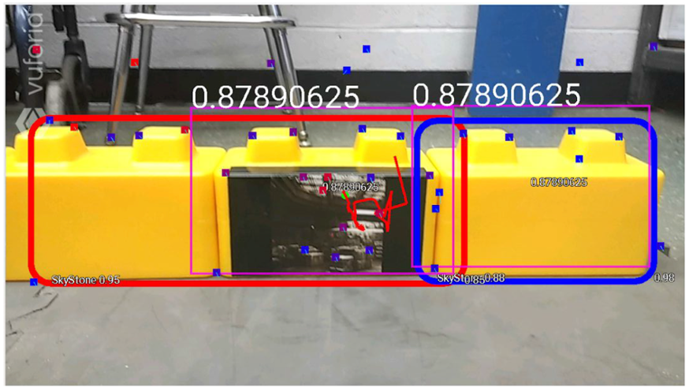
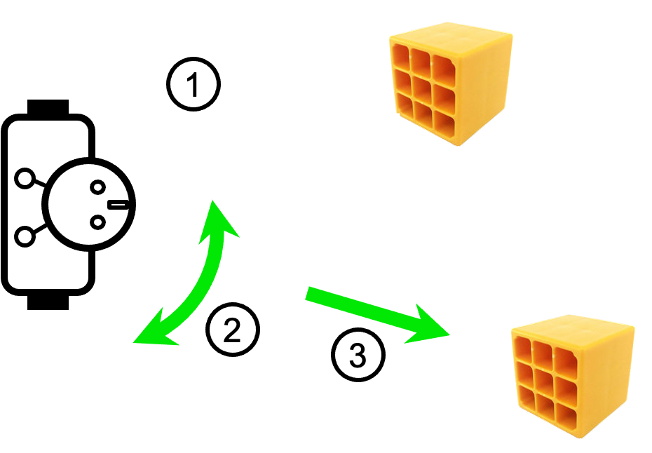

# TensorCode for FTC Competitions

LinkedIn has identified the Machine Learning Engineer as one of the five top emerging jobs in 2018. The top skills include Deep Learning, Machine Learning, and TensorFlow. QualComm has integrated it into the FTC STK giving our teams an opportunity to learn and leverage this emerging technology.  This tutorial shows you how to write the java code required to locate objects using TensorFlow. Once an object of interest is located the program computes the horizontal offset from the center of the screen. The code required to move the robot toward a game piece is included in this GitHub project. You will find links to the code below. If there is interest, future tutorials will explain how this code works.

My goal is to show you how to apply TensorFlow to FIRST Tech Challenges. I have written these demos to work with Rover Ruckus and to solve part of its challenge. Changing the program to recognizes objects from other challenges is a matter of changing the name of the model file in the loadModelFromAsset method call. My job is to show you how to do this for Rover Ruckus. Your job is to modify the program to load the model for the current challenge. 

I wish you good luck and hope you have as much fun as I have.

Ed  
Dr. Edward C. Epp  
Oregon IEEE RAS Chair  

<!---

--->

  

## Object Detection with TensorFlow 

### Overview

The material in this section supports 
- Recognizing the object of interest: Step 1 in the diagram above
- Computing the offset of the object from the horizontal center of the display screen to support turning the robot toward the object: Step 2
- Understanding recognition confidence
- Exploring issues that may impact confidence
- Managing error recovery
- Making the code easier to manage by using methods

### Tutorial Video

The YouTube tutorial video can be found at:

- [Tutorial Video](https://www.youtube.com/watch?v=Cd2PYhapyvw)

A YouTube demo of the TensorFlow code in action can be found at:

- [Locate Gold Mineral And Push Demo Video](https://youtu.be/GBGK6WiEGt4)

### Presentation Slides

The PowerPoint slides used in the 2020 video tutorial to explain object detection are found in the PDF file FTCOjectDetectionWOffset30.pdf at:

- [Video Tutorial Slides](https://drive.google.com/file/d/17m7KTk_3dXme-aBUYMyznHNLZDZ3_Imc/view?usp=sharing)

The PowerPoint hands-on slides used in the October 23, 2021 ORTOP FIRST Fair are found in the PDF file FTCObjectDectionHandsOn100Download.pdf at:

- [Hands-on Tutorial Slides](https://drive.google.com/file/d/1kpgT7OyKwnajkTZWaBwnLGgEjp2ezbkk/view)

### 2020 Code for Video Presentaion

The TensorFlow object detection and turn offset computation Java code is found in this GitHub directory in the file ObjectDetetionEpp.java

  - [ObjectDetectionEpp.java](https://github.com/edcepp/FTCEppTensorCode/blob/master/FTCEppTensorCode/ObjectDetectionEpp.java)

  - [ComputeTurnEpp.java](https://github.com/edcepp/FTCEppTensorCode/blob/master/FTCEppTensorCode/ComputeTurnEpp.java)

### 2021 Freight Frenight Frenzy Code for the Hands-on Tutorial

  - [TestTensorFlowObjectDectionWebcamEpp.java](https://github.com/edcepp/FTCEppTensorCode/blob/master/FTCEppTensorCode/TestTensorFlowObjectDetectionWebcamEpp.java)
  - [TestTensorFlowObjectDectionWebcamEpp.pdf](https://drive.google.com/file/d/1h8CBaiAFx5xx20v7qtYY1kGVVZPUgDYx/view)

### 2021 Code for Hands-on Tutorial

## Orient Robot Toward Gold Mineral

### Overview

The code in this section turns the robot towards the gold mineral. This represents Steps 1) and 2). The tutorial videos and slides have not been constructed.

### Code

  - [OrientToGoldEpp.java](https://github.com/edcepp/FTCEppTensorCode/blob/master/FTCEppTensorCode/OrientToGoldEpp.java)

## Move the Robot to the Gold Mineral using a State Machine 

### Overview

The code in this section completes the goals to point Rover Ruckus robot in the direction to move the gold mineral off of its location. In completes steps 1), 2) and 3).

### Code
 
  - [LocateGoldAndPushLinearMinninEpp.java](https://github.com/edcepp/FTCEppTensorCode/blob/master/FTCEppTensorCode/LocateGoldAndPushLinearMinniEpp.java)

## Resource and Implementation Notes

The author maintains his resource and implemetation notes on his home media server. You may find some of them of help. 

Disclaimer: Information on the following wiki are there for the author's use and may not be complete or accurate.

- [Author's FTC 2020 Wiki Site](http://zdome.net:/wiki/index.php/FTC_2020)

